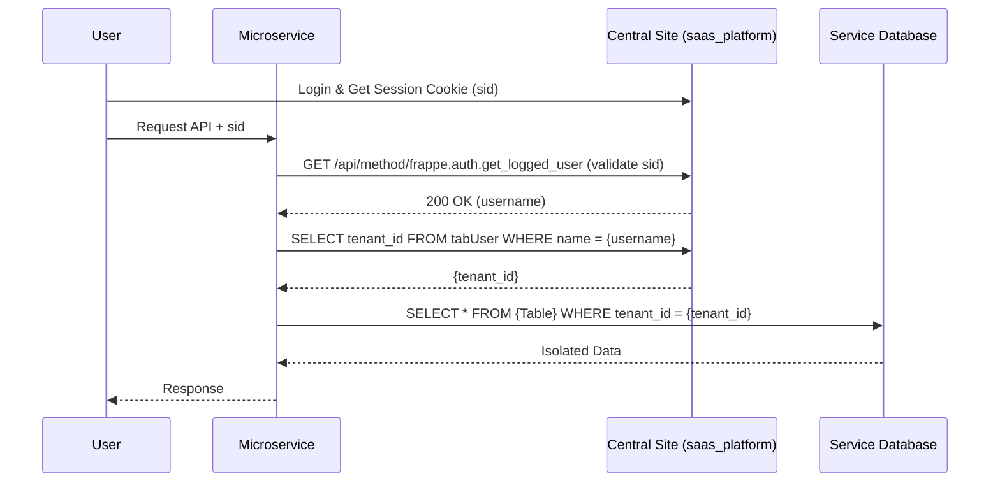

# Microservice Integration Guide

This document explains how the `saas_platform` app on the Central Site enables the Frappe Microservice ecosystem.

## Overview

The **Frappe Microservice Framework** depends on `saas_platform` for two primary reasons:
1.  **Shared Authentication**: Users log in once to the Central Site and access microservices via the same session.
2.  **Tenant Identification**: Microservices rely on the `tenant_id` field managed by `saas_platform` to enforce data isolation.

## Role of `saas_platform`

### 1. Unified User Schema
`saas_platform` adds a `tenant_id` field to the `User` DocType on the Central Site. This field is the "anchor" for multi-tenancy. When a microservice receives a request, it:
- Validates the session against the Central Site.
- Queries the Central Site's `tabUser` table to find the `tenant_id` for that specific user.

### 2. Session Hook
The app includes an `on_session_creation` hook ([hooks.py](saas_platform/hooks.py)) that ensures the `tenant_id` is loaded into the user's session metadata immediately upon login.

```python
# saas_platform/hooks.py
on_session_creation = "saas_platform.utils.tenant.on_session_creation"
```

## Integration Checklist for Microservices

When building a microservice that connects to a Central Site running `saas_platform`:

- **Central Site URL**: Ensure the `CENTRAL_SITE_URL` environment variable is correctly set in your microservice.
- **User Availability**: The user must exist and be `enabled` on the Central Site.
- **Tenant Assignment**: The user MUST have a valid `tenant_id` assigned in their user profile on the Central Site. Users with a `SYSTEM` or null `tenant_id` will be rejected by the microservice as a security precaution.

## Technical Flow



## Troubleshooting

1.  **"No tenant_id found"**: Ensure the `saas_platform` app is correctly installed on the Central Site and that the `tenant_id` field is visible in the User DocType.
2.  **Session Rejected**: Check if the `sid` cookie is being passed correctly between domains (if applicable).
